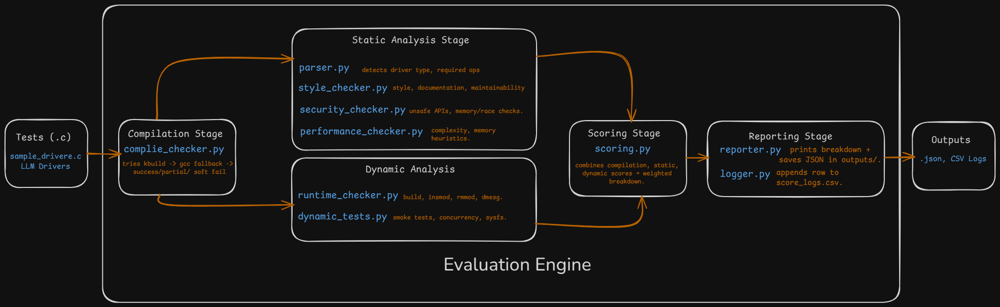

# Linux-Driver-Code-Grader

The **Linux-Driver-Code-Grader** is a framework for evaluating Linux kernel driver code.
It performs compilation, static analysis, dynamic runtime checks, and structured scoring across multiple quality dimensions.
The tool is designed for assessing automatically generated driver code (e.g., from large language models) as well as manually written drivers.

---

## System Architecture

The system architecture is illustrated below:



Detailed documentation (rubrics explanation, user guide, and system architecture notes) is available in the [`docs/`](docs/) folder.

---

## Features

* **Compilation Checks**

  * Linux kernel kbuild integration
  * GCC fallback mode for syntax-only checks
  * Error/warning capture with “soft pass” for missing headers

* **Static Analysis**

  * Parser for driver type detection and required callbacks
  * Security analysis: unsafe functions, race conditions, input validation
  * Style and documentation checks (`checkpatch.pl`, heuristics)
  * Performance heuristics: complexity, memory usage, scalability

* **Dynamic Runtime Analysis**

  * Builds `.ko` modules and attempts load/unload
  * Validates kernel logs (`dmesg`)
  * Smoke tests for `/dev` and `/proc/devices` entries
  * Extensible for functional runtime validation

* **Scoring System**

  * Correctness (40%), Security (25%), Code Quality (20%), Performance (10%), Advanced Features (5%)
  * Detailed breakdown by category and sub-metrics

* **Reporting & Logging**

  * Console summaries for quick review
  * JSON reports in `outputs/`
  * CSV log of all runs in `score_logs.csv`

---

## Project Structure

```
Linux-Driver-Code-Grader/
├── Evaluator/                  # Main evaluation engine
│   ├── evaluator.py            # Entry point (orchestrates evaluation)
│   ├── compile_checker.py      # Compilation tests (kbuild + gcc fallback)
│   ├── parser.py               # Driver type detection & structure checks
│   ├── style_checker.py        # Style, documentation, maintainability
│   ├── security_checker.py     # Security checks
│   ├── performance_checker.py  # Performance heuristics
│   ├── runtime_checker.py      # Build/load/unload runtime tests
│   ├── dynamic_tests.py        # Smoke tests and runtime extensions
│   ├── scoring.py              # Weighted scoring logic
│   ├── reporter.py             # Console + JSON reporting
│   ├── logger.py               # Logs scores into score_logs.csv
│   └── checkpatch.pl           # Kernel style checker
│
├── Tests/                      # Sample/test drivers
├── outputs/                    # JSON reports generated per evaluation
├── score_logs.csv              # CSV log of all runs
├── prompts.txt                 # Sample prompts for LLM driver generation
├── setup.sh                    # Dependency installation script
├── Makefile                    # Batch run all test drivers
├── docs/                       # Documentation and diagrams
│   ├── architecture.png        # System architecture diagram
│   ├── rubrics.md              # Rubrics explanation
│   ├── user_guide.md           # User guide
│   └── system_architecture.md  # Architecture documentation
└── README.md                   # Project overview
```

---

## Installation & Requirements

### Prerequisites

* Linux (Ubuntu 22.04+ recommended)
* Python 3.9+
* `gcc`, `make`, `kmod`
* Linux kernel headers (`/lib/modules/$(uname -r)/build`)
* Static analysis tools: `sparse`, `clang-format`, `clang-tidy`, `cppcheck`

### Setup

```bash
git clone https://github.com/VedantNipane/Linux-Driver-Code-Grader.git
cd Linux-Driver-Code-Grader
chmod +x setup.sh
./setup.sh
```

---

## Usage

### Evaluate a single driver

```bash
python3 Evaluator/evaluator.py Tests/sample_driver.c
```

### Evaluate all drivers

```bash
make run
```

---

## Example Output

```
=== Evaluation Report ===
File: Tests/sample_driver.c
Compilation: Success (method=kbuild)
Warnings: 1 Errors: 0

--- Score Breakdown ---
Correctness: 38.0/40
Security: 23.1/25
Code Quality: 13.2/20
Performance: 8.0/10
Advanced: 0.0/5

Overall Score: 82.3/100
Report saved to: outputs/sample_driver_results.json
```

---

## Documentation

The following detailed documents are included in the `docs/` folder:

* **System Architecture** – design overview and flow between modules
* **Rubrics Explanation** – scoring criteria, weights, and rationale
* **User Guide** – installation, usage, and analysis instructions

---

## References

* [Linux Kernel Coding Style](https://www.kernel.org/doc/html/latest/process/coding-style.html)
* *Linux Device Drivers, 3rd Edition* (O’Reilly)
* `checkpatch.pl` (from Linux source tree)
* [Kernel testing Guide](https://docs.kernel.org/dev-tools/testing-overview.html)

---

## Authors

Maintainer: [Vedant Nipane](https://github.com/VedantNipane)

---
